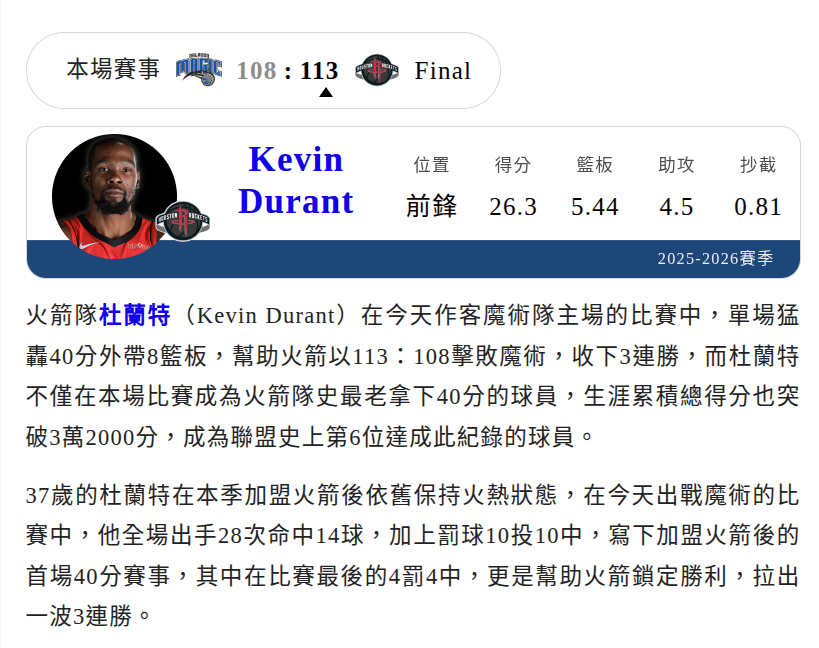
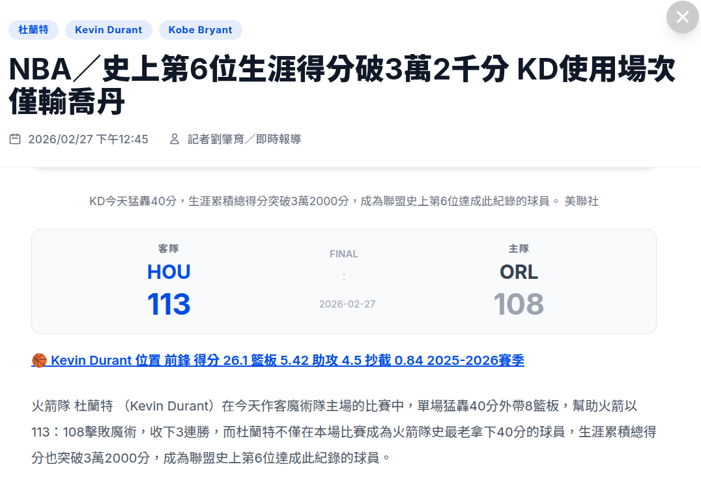
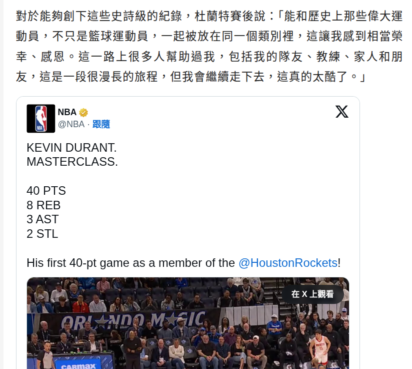
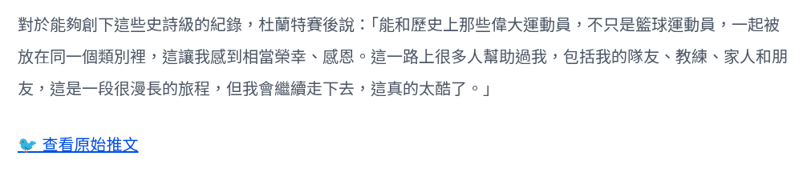
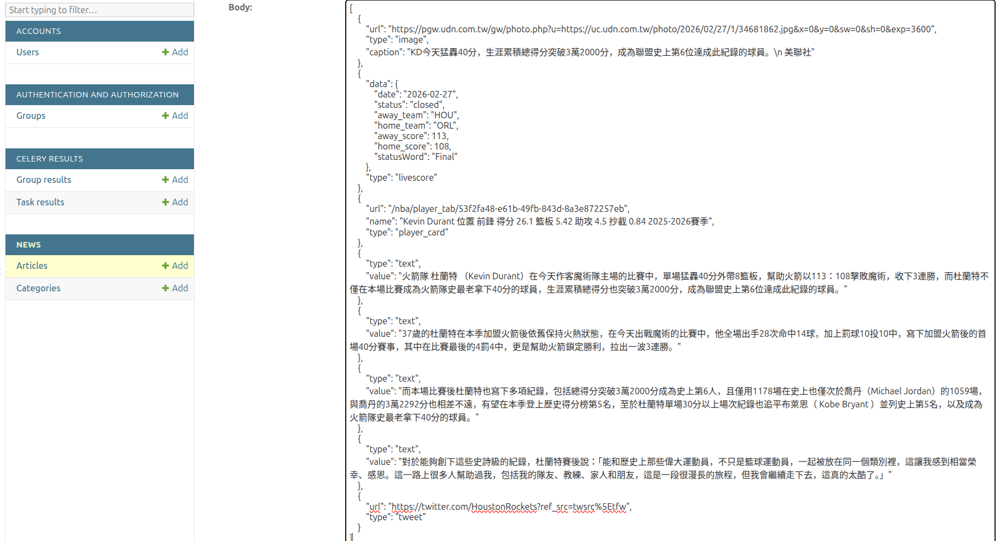
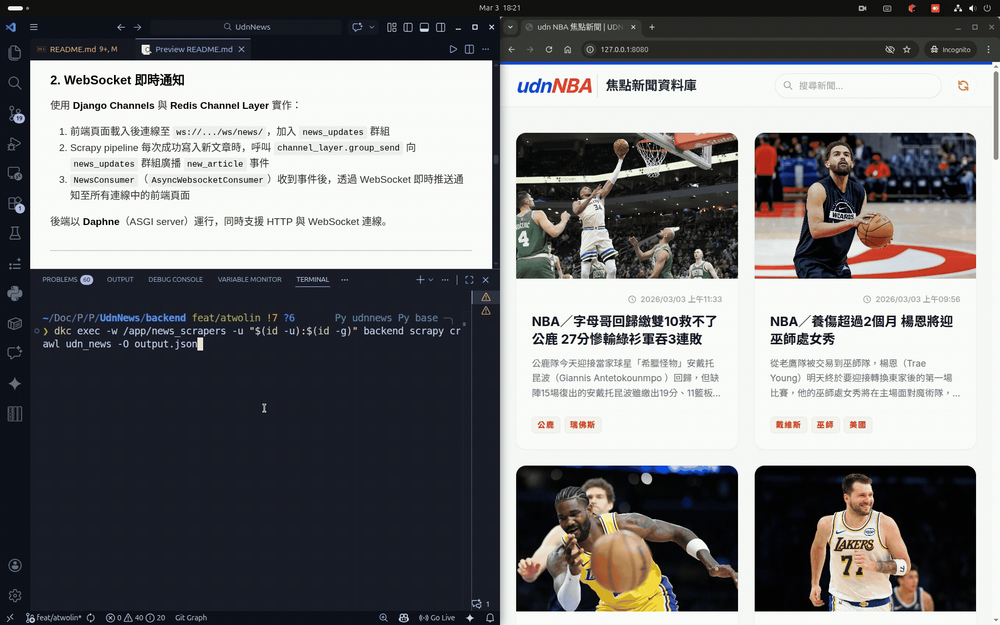

# Unnotech Backend Engineer 徵才小專案

1. [x] 抓取 <http://tw-nba.udn.com/nba/index> 中的焦點新聞。
2. [x] 使用 [Django](https://www.djangoproject.com/) 設計恰當的 Model，並將所抓取新聞存儲至 DB。
3. [x] 使用 [Django REST Framework](http://www.django-rest-framework.org/) 配合 AJAX 實現以下頁面：
    * 焦點新聞列表
    * 新聞詳情頁面

4. [x] 以 Pull-Request 的方式將代碼提交。

## 進階要求

1. [x] 實現爬蟲自動定時抓取。
2. [x] 使用 Websocket 服務，抓取到新的新聞時立即通知前端頁面。
3. [x] 將本 demo 部署到伺服器並可正確運行。
4. [ ] 所實現新聞列表 API 可承受 100 QPS 的壓力測試。

---

## Demo

**部署網址**：<https://35.208.58.161.sslip.io/>

**API Endpoint**：
  新聞列表: <https://35.208.58.161.sslip.io/api/articles/>
  新聞詳情頁面: <https://35.208.58.161.sslip.io/api/articles/{id}/>，如：https://35.208.58.161.sslip.io/api/articles/1/


**本地啟動**：

```bash
docker compose up --build
```

---

## 設計與實作說明

### 基本要求

#### 1. 抓取焦點新聞

使用 **Scrapy** 實作 `UdnNewsSpider`，爬取 `https://tw-nba.udn.com/nba/index` 的焦點新聞輪播區塊（`.focus_body`）。

爬取分為兩個 phase：

* **Phase 1（index 頁）**：遍歷 `focus_body`，取得各焦點新聞的連結。由於 UDN CMS 存在 bug，部分連結的 `href` 填入了無效值（如 `_blank`、`N`），無法直接使用。解決方式是先掃描頁面其他區塊中所有完整的文章連結，建立「標題 → URL」對應表，再以 `difflib.SequenceMatcher` 模糊比對焦點新聞標題（相似度 ≥ 0.7），找回對應的正確 URL。
* **Phase 2（文章詳情頁）**：優先解析頁面中的 JSON-LD 結構化資料（`<script type="application/ld+json">`）取得標題、摘要、作者、發布時間等欄位；JSON-LD 不存在時才回退到 HTML 選擇器。文章內文從 `#story_body_content` 解析，將 `figure`（圖片）與 `p`（[文字段落、Twitter 嵌入、影片、livescore widget 等內容](docs/non-text-content-types.md)）逐一轉換為帶有 `type` 鍵的 block，保留原始版面結構。

為避免重複爬取，pipeline 啟動時會預載資料庫中已有的所有 `story_id`，Phase 1 便能在發出詳情頁請求前直接跳過已知文章，減少不必要的網路請求。

---

#### 2. Django Model 設計

定義兩個 model：

**`Category`**（新聞分類）

| 欄位 | 說明 |
|---|---|
| `category_id` | UDN 分類代碼（unique），來自 URL 路徑，例如 7002、122629 等 |
| `name` | 分類名稱 |

**`Article`**（焦點新聞文章）

| 欄位 | 說明 |
|---|---|
| `story_id` | UDN 文章唯一識別碼（unique），來自 URL 路徑 |
| `url` | 文章連結（unique） |
| `title` | 文章詳情頁的標題 |
| `focus_title` | 焦點輪播顯示的標題（可能與詳情頁標題不同，是詳情頁標題的簡化版本） |
| `summary` / `author` / `keywords` | 文章 metadata |
| `image_url` | 封面圖 URL |
| `category` | ForeignKey → `Category` |
| `published_at` / `modified_at` | 來自 JSON-LD 所紀錄的發布與修改時間 |
| `body` | JSONField，文章內文以有序 block 陣列儲存，保留原始文章版面結構 |
| `scraped_at` / `updated_at` | 系統爬取與追蹤資料的時間 |

`body` 中每個 block 為帶有 `type` 鍵的 dict，支援 `text`、`image`、`tweet`、`video`、`livescore`、`player_card` 六種類型，讓前端能依類型分別渲染。

<details>
<summary><b>爬蟲與前端渲染截圖（點擊展開）</b></summary>
<br>

| 原始網站內容 (推文、比賽數據) | 本系統前端渲染 |
| --- | --- |
|  |  |
|  |  |

**後端儲存之 Block 資料：**


</details>

此外， `Article` 在 `pipeline.py` 中，是透過 `update_or_create` 寫入，確保重跑爬蟲時資料保持最新而不重複。

---

#### 3. 焦點新聞列表與詳情頁（DRF + AJAX）

後端以 **Django REST Framework** 的 `ReadOnlyModelViewSet` 提供兩支 API：

| Endpoint | 說明 |
|---|---|
| `GET /api/articles/` | 焦點新聞列表，每頁 20 筆，不含文章內文 |
| `GET /api/articles/{id}/` | 新聞詳情，含完整 `body` blocks |

列表與詳情使用不同的序列化器（`ArticleListSerializer` / `ArticleDetailSerializer`），列表端點不回傳內文龐大的 `body` 欄位，降低傳輸量。同時支援 `?search=` 關鍵字搜尋與 `?category=` 分類過濾。

前端為純 HTML + JavaScript 頁面，以 AJAX（`fetch`）呼叫上述 API 動態載入資料，實現焦點新聞列表頁與新聞詳情頁。

---

### 進階要求

#### 1. 爬蟲自動定時抓取

使用 **Celery Beat** 排程，每 2 小時整點觸發一次爬蟲任務（`crontab(minute=0, hour="*/2")`）。

考量焦點新聞輪播約每 1–3 小時更新一篇，每 2 小時執行一次可確保幾乎不遺漏新文章。由於爬蟲在 Phase 1 即跳過已知文章，大多數執行只需 1–2 次 HTTP 請求，對目標伺服器的負擔低，因此選擇每 2 小時執行一次爬蟲任務。

---

#### 2. WebSocket 即時通知

使用 **Django Channels** 與 **Redis Channel Layer** 實作：

1. 前端頁面載入後連線至 `ws://.../ws/news/`，加入 `news_updates` 群組
2. Scrapy pipeline 每次成功寫入新文章時，呼叫 `channel_layer.group_send` 向 `news_updates` 群組廣播 `new_article` 事件
3. `NewsConsumer`（`AsyncWebsocketConsumer`）收到事件後，透過 WebSocket 即時推送通知至所有連線中的前端頁面

**WebSocket 即時通知示意圖：**



後端以 **Daphne**（ASGI server）運行，同時支援 HTTP 與 WebSocket 連線。

---

#### 3. 部署至伺服器

整個專案以 **Docker Compose** 容器化，部署於 **Google Cloud Platform（GCP）** VM (e2-medium)，服務包含：

* `backend`：Django + Daphne（ASGI），port 8000
* `frontend`：Nginx 靜態頁面，port 8080
* `db`：PostgreSQL 16
* `redis`：Redis 7（Celery broker + Channel Layer）
* `celery-worker` / `celery-beat`：任務執行與排程

生產環境開啟 HTTPS redirect、HSTS、CSRF secure cookie 等安全設定。靜態檔案由 WhiteNoise middleware 直接由 Django 提供。

---

#### 4. 新聞列表 API 承受 100 QPS

為使 `GET /api/articles/` 能承受 100 QPS，實作以下設計：

* **DB 索引**：`Article` 在 `-published_at` 與 `category` 欄位建立索引，列表排序與過濾查詢不走全表掃描
* **避免 N+1**：ViewSet 的 queryset 使用 `select_related("category")`，每次請求僅 1 次 DB 查詢
* **分頁**：每頁回傳 20 筆，限制單次回應資料量
* **輕量序列化**：列表端點使用 `ArticleListSerializer`，不序列化 `body` 欄位

##### 壓力測試結果（Locust）

###### 測試環境

* **工具**：Locust 2.43.3
* **設定**：100 虛擬使用者（`-u 100`）、每秒產生 10 人（`-r 10`）、持續 60 秒（`-t 60s`）
* **目標**：`https://35.208.58.161.sslip.io`
* **執行日期**：2026-03-03

每位 User 的行為分佈（`locustfile.py`）：

| Task 權重 | Endpoint |
|---|---|
| 10 | `GET /api/articles/` |
| 2 | `GET /api/articles/?page=2` |
| 1 | `GET /api/articles/?search=NBA` |

###### 測試結果

| Endpoint | 請求數 | 失敗率 | 平均回應時間 | P50 | P95 | P99 | req/s |
|---|---|---|---|---|---|---|---|
| `GET /api/articles/` | 992 | 0% | 4,246 ms | 4,200 ms | 6,400 ms | 7,200 ms | 16.57 |
| `GET /api/articles/?page=N` | 217 | 0% | 2,945 ms | 3,000 ms | 4,600 ms | 5,400 ms | 3.62 |
| `GET /api/articles/?search=...` | 101 | 0% | 4,168 ms | 4,300 ms | 5,600 ms | 6,600 ms | 1.69 |
| **Aggregated** | **1,310** | **0%** | **4,025 ms** | **4,100 ms** | **6,200 ms** | **7,100 ms** | **21.88** |

###### 問題分析

1. 未達 100 QPS 目標

    實際吞吐量僅約 **22 RPS**，不到目標的 1/4。根本原因是回應時間過高（平均約 4 秒、最差約 8 秒）。locustfile 使用 `constant_throughput(1)`，意即每位 User 每秒各發 1 個請求，但回應時間遠超 1 秒，導致 User 全部阻塞等待，有效 RPS 遠低於 100。

2. 回應時間過高

    | 百分位 | `/api/articles/` |
    | --- | --- |
    | P50 | 4,200 ms |
    | P95 | 6,400 ms |
    | P99 | 7,200 ms |
    | Max | 8,285 ms |

    可能原因：

    * **Daphne 單 process**：所有並發請求排隊等待單一 worker 處理，CPU 成為瓶頸
    * **無 HTTP 快取**：每次請求都打一次 DB
    * **無連線池**：每次 DB 查詢都等待新連線建立

###### 效能改進方向

* 多 Worker Process

  目前 Daphne 為單 process，改用多 worker 可線性擴展吞吐量或將 backend 橫向擴增多個 container，在 Nginx upstream 做 load balance。
* Redis 快取列表結果

  文章列表為讀多寫少的資料，可快取整頁回應，大幅降低 DB 壓力。
* DB 連線池（PgBouncer）

  在 PostgreSQL 前加一層 PgBouncer（transaction mode），讓多個 Django worker 共用有限的 DB 連線，避免連線數爆炸。
